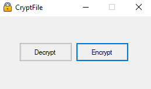
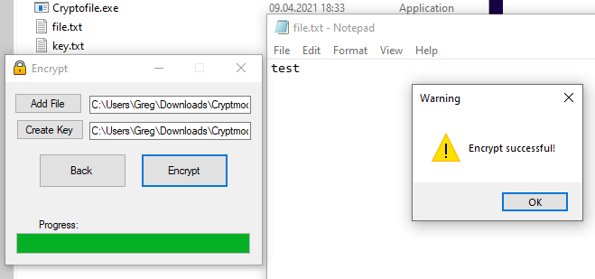
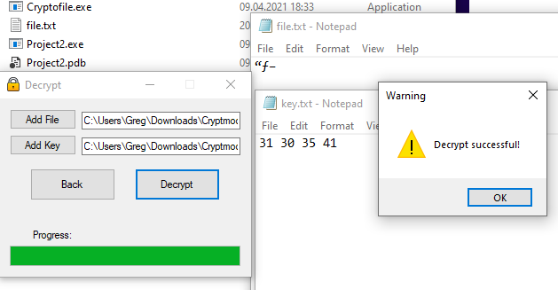

# Cryptmodule
this module encrypts the data based on the processor frequency at a certain time

## this module encrypts the data based on the processor frequency at a certain time and generates the decryption key in a separate txt file. To decrypt we use this file

